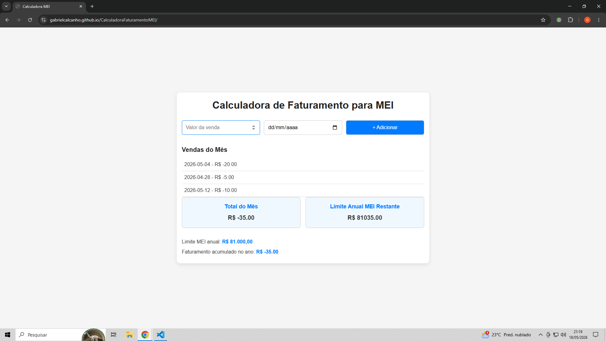

# Projeto QA — Calculadora de Faturamento MEI

#  Sobre o projeto
Este projeto simula uma aplicação de controle de faturamento para MEI, permitindo registrar vendas e calcular o total mensal.

O objetivo principal deste projeto é realizar testes manuais como um QA, validando regras de negócio e identificando possíveis falhas.

---

# Acesso ao sistema
<<<<<<< HEAD
https://gabrielcalcanho.github.io/CalculadoraFaturamentoMEI/
=======
👉 Link do GitHub Pages: COLOQUE AQUI
>>>>>>> a74cad46e785b0a3e7f073eebdef289c719df2d5

---

# Funcionalidades
- Adicionar vendas com valor e data
- Calcular total mensal automaticamente
- Remover vendas
- Validação de campos obrigatórios

---

<<<<<<< HEAD

=======
>>>>>>> a74cad46e785b0a3e7f073eebdef289c719df2d5
# Testes realizados
- Plano de testes criado
- Casos de teste executados
- Testes funcionais e de validação
- Identificação de bugs

---

# Bugs encontrados
- Valor negativo permitido (BUG-001)
- Validação de campos obrigatórios

---

# Evidências (IMAGENS)

# Tela inicial do sistema

---

# Venda adicionada

---

# Bug - valor negativo

